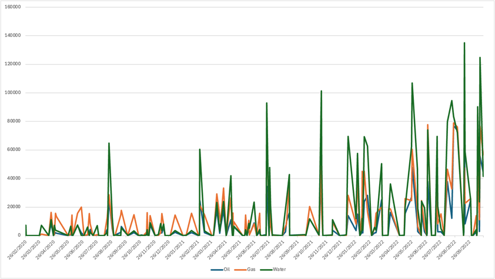
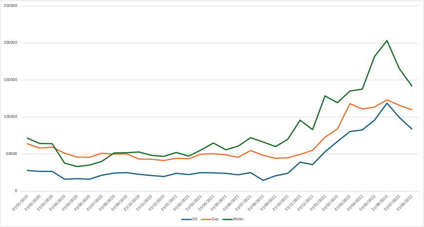

# Project description

The goal of this project is to set up a mini etl platform to process raw data from the `input` directory 
and load it into a postgres database.

Treat the provided codebase as if it's already in production and populating a postgres database.
Currently, it only loads a sample of wells in Utah, but ultimately our product is a dataset
that handles way bigger input data from multiple states.

We leave it up to you to refactor and design the codebase however you feel is appropriate.

The resulting dataset should contain information about individual wells and their monthly production data.
The data in these tables should be reasonable in that they conform with industry standards.
We will act as industry experts for this assignment, and you can ask us any industry-related questions you want. 

Customers of this database should be able to see clearly:
 - which wells are horizontal and which are not
 - what the lateral lengths are of the horizontal wells
 - what the surface hole and bottom hole locations are of each well 
 - how much oil and gas was produced by each well each month

## Setup

	py -m venv venv
	export PYTHONPATH=$(pwd)
	source venv/bin/activate
    pip install -r requirements.txt

    py etl.py

## Task 1: solve a bug

We've noticed that our production looks like this:

However, based on knowledge of the industry and ground-truth data from [EIA](https://www.eia.gov/petroleum/production/)
we were expecting the graph look more like this:

Reproduce, find and fix the issue.

## Task 2: add two simple features

Add a single new column `PLSS` to the `Wells` table that contains its location
in the [PLSS grid format](https://en.wikipedia.org/wiki/Public_Land_Survey_System).
For example for well `4301330372` it should be `SWNE 24 3S 6W`

For each of the production streams (oil, gas, water) add a new column in the `Wells` table
containing the lifetime cumulative production of that stream.

## Task 3: add a more complex feature

An important feature about horizontal wells in shale-plays is "well-spacing". This refers to how close together wells 
should be drilled in order to maximize profit on a given acreage. If you drill the wells too far apart then you may 
waste left-over reserves in the ground, but if you drill them too close you risk the wells producing too little (due 
to nearby wells interfering with each other) that they are not economical anymore. One of the main challenges in the 
industry is to figure out the optimal well-spacing for a given acreage.

We can calculate various features that collectively describe each well in relation to its neighbours.
Come up with one such well-spacing feature and implement it.
Basically, we're looking for some numerical value that would describe each well's "neighbourhood".
Add a relevant column to the `Wells` table.
